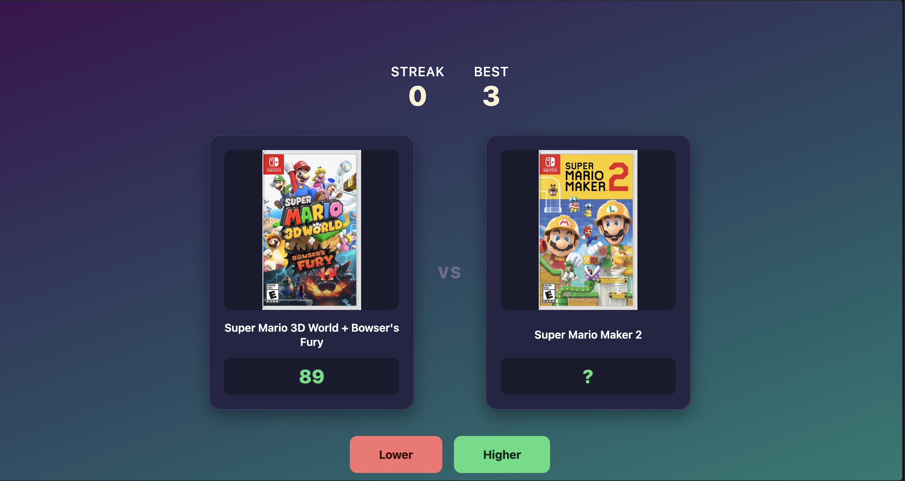

# Mario Higher or Lower

A browser game where you guess whether one Mario game scored higher or lower on
Metacritic than another. Get it right and the streak continues, but get it wrong and
you start over.

Built with plain HTML, CSS, and JavaScript. No frameworks, no build step, no backend.



## How to play

- Two Mario games are shown side by side; the left game's Metacritic score is visible
- Guess whether the right game scored **higher** or **lower**
- Correct guesses extend your streak and the revealed game becomes the new comparison
- A wrong guess ends the run — your best streak is saved between sessions

## Features

- 25 Mario games with real Metacritic scores and official box art
- Streak tracking with a persistent best-streak saved via `localStorage`
- Ties count as correct, so identical scores never end a run unfairly
- Inputs lock during the score reveal so a fast second click can't skip a round
- Guaranteed-distinct pairings meaning the same game never faces itself

## Tech stack

- **HTML** for structure
- **CSS** for layout and styling (flexbox, gradients, transitions)
- **Vanilla JavaScript** for game logic and DOM manipulation
- **localStorage** for persisting the best streak across sessions

## Running it locally

No install or build step needed:

```bash
git clone https://github.com/MasonBartell/mario-higher-lower.git
cd mario-higher-lower
```

Then open `index.html` in any browser.

## Design notes

Each game is stored as an object with a title, score, and image path, all held in a
single array. The two on-screen games are tracked in variables that get reassigned
each round rather than re-rendering the whole page — on a correct guess, the revealed
game becomes the new comparison point and only the opponent is re-picked, which keeps
runs feeling continuous.

The score reveal is deliberately delayed before the next round loads, and both buttons
are disabled during that window so a rapid second click can't register against the
round that's already been decided.

## What I'd add next

- A visual flash or animation on correct/incorrect guesses
- A proper game-over screen instead of a browser alert
- More games, and possibly other franchises to compare against
